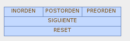
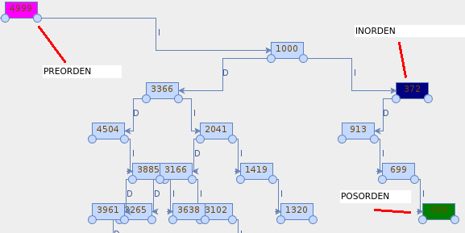
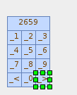
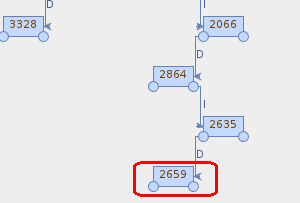
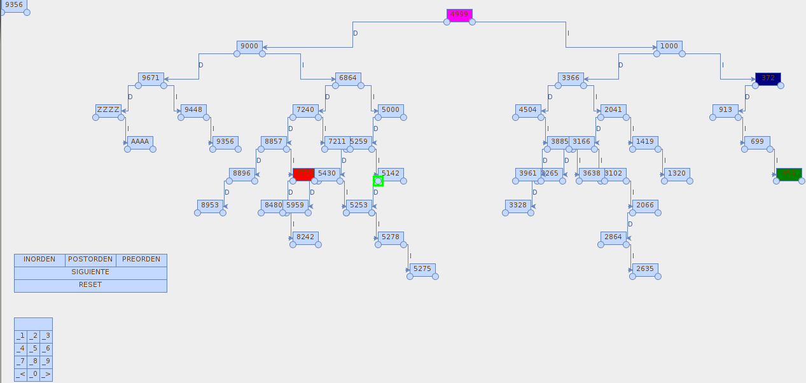

# Laboratorio 3 Alboles estructuras.

El siguiente es el enunciado del programa que se debe implementar en un lenguaje de programación y relacionado con el tema de árboles binarios.

## Parametros

Se debe implementar un programa en un lenguaje de programación que permita realizar operaciones con memoria dinámica y recursividad , construir un árbol binario de la cantidad de nodos que indique el usuario, con información numérica y entera.

## Using it

### Recorrer el arbol:
Menu para recorrer el arbol.

Escoja el modo y luego de siguiente para seguir el orden.

### Agregar un nodo:
Agregar el nodo en el menu estilo display:

Es agregado el nodo al arbol.

## History

## Credits

- Java 2 - Curso de Programación 4Ed - Scribd
- http://distancia.upla.edu.pe/libros/sistemas/05/algoritmo%20y%20estructura%20de%20base%20de%20datos%20II.pdf
- https://github.com/jgraph/jgraphx

## License

The source is under terms of the MIT license.
